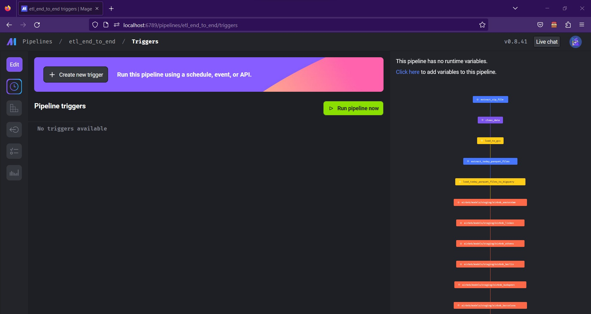

# Airbnb Prices in European Cities

## Overview

This project uses [Kaggle dataset](https://www.kaggle.com/datasets/thedevastator/airbnb-prices-in-european-cities) to find story to tell about Airbnb prices in Europe cities.

## Prerequisites

- Terraform
- Docker and docker compose
- Google Cloud Platform (GCP)

## Architecture

Technologies used in this project:

- Workflow orchestrator: Mage AI
- Tranformation framework: DBT
- Data lake: Google Cloud Storage
- Data warehouse: Google BigQuery
- Infrastructure as Code: Terraform

## Instruction

0. Create GCP project named `dtc-airbnb`.
1. Create service account on GCP inside `dtc-airbnb` project with 4 following roles: **Actions Viewer**, **BigQuery Admin**, **Storage Admin**, **Storage Object Admin**. Then, download this GCP service account credential JSON file to somewhere on your machine and set the absolute path to `GOOGLE_APPLICATION_CREDENTIALS` environment variable: `export GOOGLE_APPLICATION_CREDENTIALS=<gcp_credential_json_path>`.
2. Bring GCP infrastructure up:
    ```
    cd infra
    terraform init
    terraform apply
    ``` 
3. Edit environment variable `GOOGLE_APPLICATION_CREDENTIALS` value in `docker-compose.yml` with `<gcp_credential_json_path>` from step 1.
4. Build Docker image: `docker compose build`
5. Bring Mage docker container up: `docker compose up -d`
6. Browse Mage UI `http://localhost:6789/pipelines/etl_end_to_end/triggers` and hit `Run pipeline now` button to run `etl_end_to_end` pipeline.
    
## Dashboard

Interactive dashboard is [here](https://lookerstudio.google.com/reporting/99e0048a-190e-475e-8009-66e833552386).

